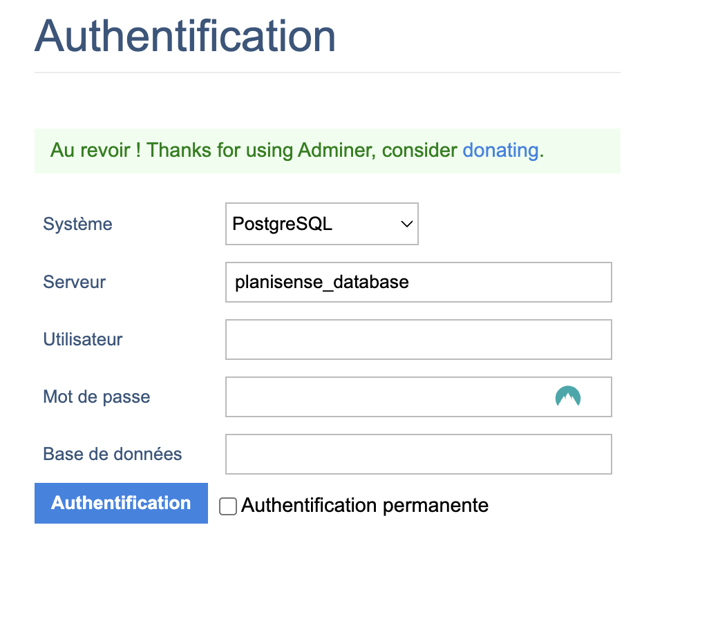

## Description

Planisense-back is a [Nest](https://github.com/nestjs/nest) project done for a tech interview. It is a really small API to work with trees in Paris area.

---

## Installation

```bash
$ yarn install
```

---

## Configuring the app

First set all the env files using the following examples :

- [The first one is used for prisma](./.env.example)
- [This is is for docker](./.env.example.postgres)

Make sure the db configurations are the same in the URL and the docker env.

---

## Running the app

Now you must create your database with docker using docker-compose:

```bash
  yarn docker:dev
```

Your database adminer will be runing [here!]("http://localhost:8080") You can now login and view your database

<br/>
<div align="center">
  
</div>

<br/>

On a separated terminal run the migrations:

```bash
  yarn migrate:dev
```

You can now start the server:

```bash
  yarn dev
```

---

## Seeding the database

In order to populate the database you'll need to request the related endpoint of the API:
`/api/tree/generate/:numberOfTrees`

This endpoint will make an API call to the Open data Paris API that returns all the trees in Paris. This endpoint is also in charge of creating every trees in the database.

The parameter `numberOfTrees` is an integer that must be lower than 200'000.

---

## Test

```bash
# unit tests
$ yarn test

# e2e tests
$ yarn test:e2e

# test coverage
$ yarn test:cov
```

---

## Stay in touch

- Author - [Faris CHTATOU](https://farischt.me)

---

## Support

This is a Nest JS project

Nest is an MIT-licensed open source project. It can grow thanks to the sponsors and support by the amazing backers. If you'd like to join them, please [read more here](https://docs.nestjs.com/support).
